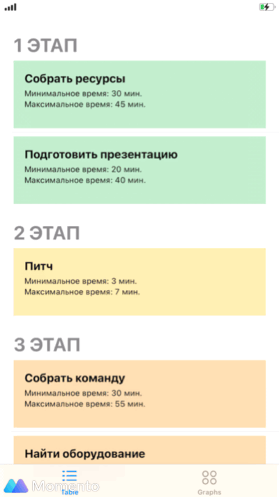
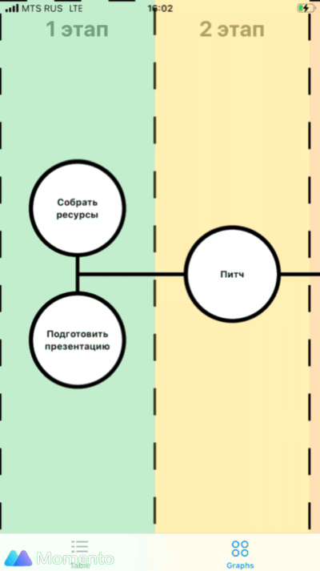
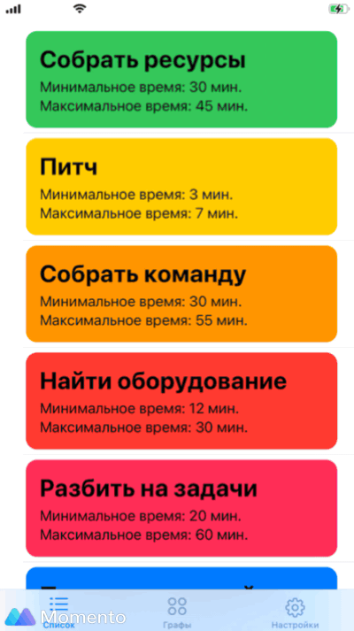
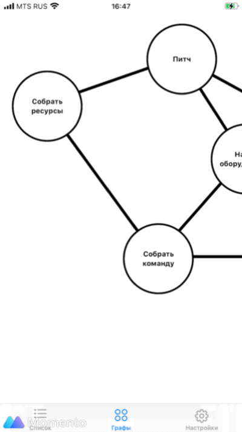
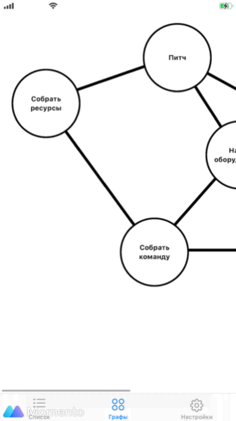

# Первая версия приложения 

### TableView


### ScrollView


### Tap Animation


При тапе анимация расширения графа, если можно так назвать + вибрация. При открытии средняя вибрация + alert показывается. При закрытии мягкая вибрация, и с задержкой 0.1 с. возвращение к изначальному размеру

 `Спасибо FeedbackGenerator за приятные вибрации (см. ниже)`
```swift
let generator = UIImpactFeedbackGenerator(style: UIImpactFeedbackGenerator.FeedbackStyle)
generator.impactOccurred()
```

# Вторая версия приложения 
### сделано: 
* `ThemeFactory` - для выбора темы 
* кастомный `ToggleStyle`
* Переделан `GraphViewScreen` 
* `TableView` также переделан 
* убран `HeaderView`, т.к не используется 
* и другие мелкие доработки

### TableView


### ScrollView


### Tap Animation

